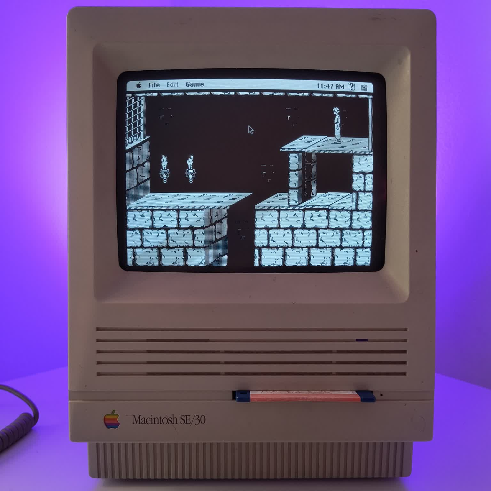
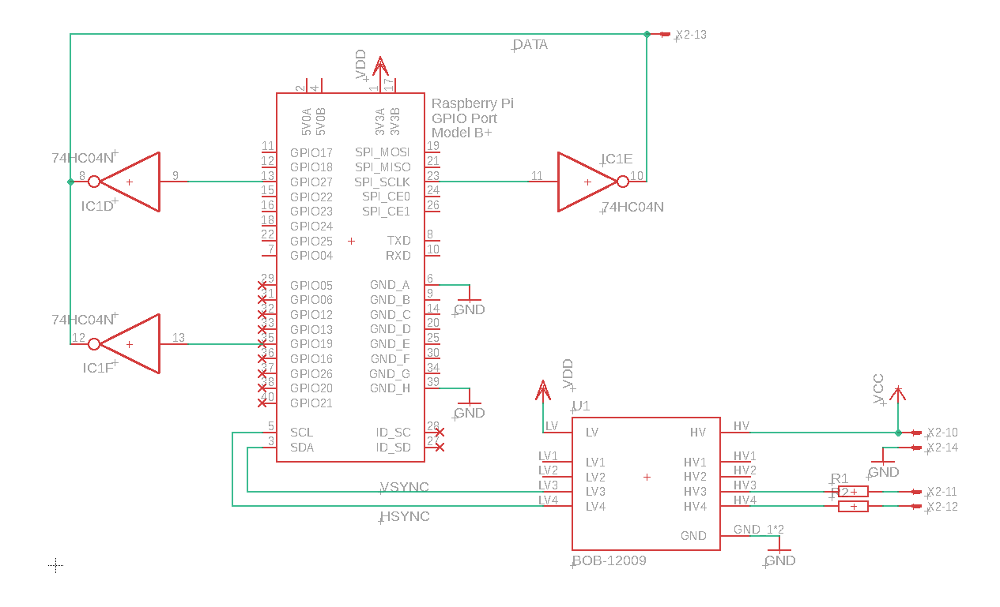
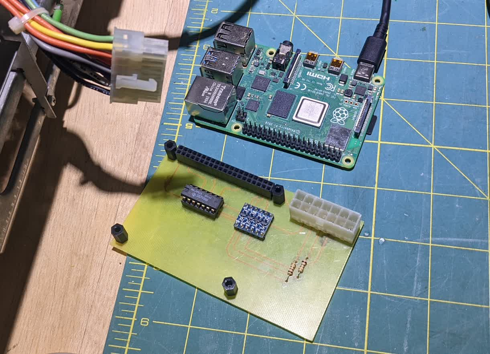
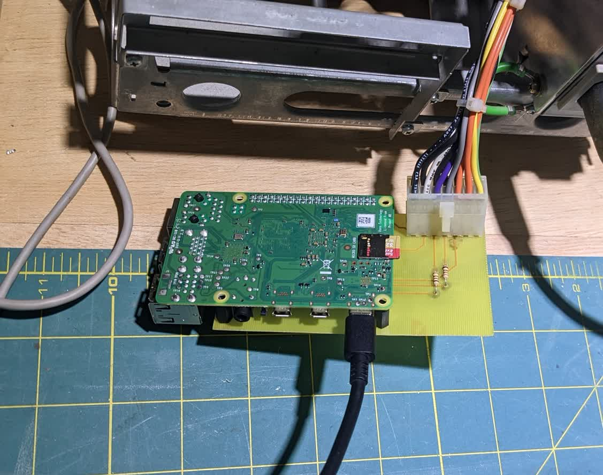
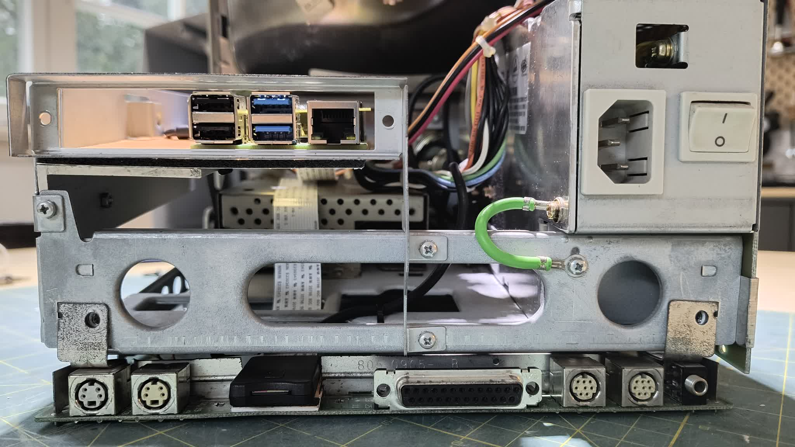
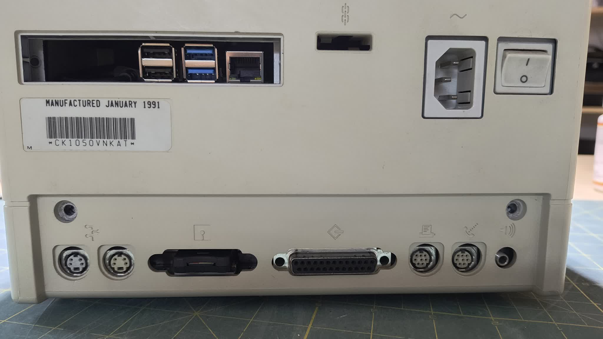
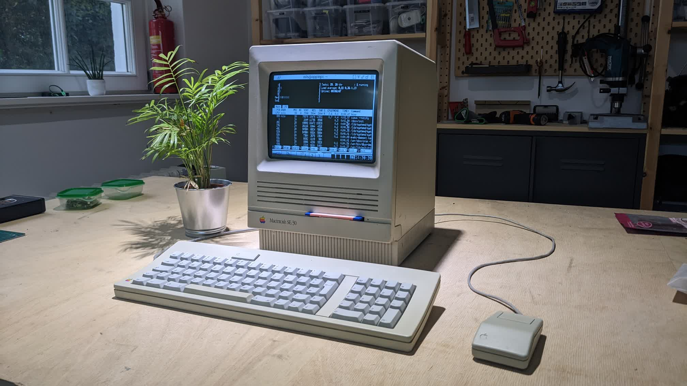

## Classic Mac CRT driver HAT for Raspberry Pi4

:warning: **Proof of concept running PoP on minivmac:**


This method is utilizing the Display Parallel Interface of the RPi. The DPI device tree overlay has to be configured correctly to make this work. *(For fine tuning, troubleshooting or more detailed explanation please follow the link in the credits section to **nerdhut**'s original article.)* :arrow_left: KUDOS

### Configuration
```
dtoverlay=dpi24
overscan_left=0
overscan_right=0
overscan_top=0
overscan_bottom=0
framebuffer_width=512
framebuffer_height=342
enable_dpi_lcd=1
display_default_lcd=1
dpi_group=2
dpi_mode=87
dpi_output_format=0x76017
dpi_timings=512 0 14 178 0 342 0 0 4 24 0 0 0 60 0 15667200 1
```

### Schematics
Theoretically you can invert the data signal by just configuring the video hardware, but instead of that I have decided to sum the highest bits of the green, blue and red channels through an inverter IC. *( It could have been just 3 transistors. )*


### Board layout
The board has been quickly put together as an afternoon project. The goal was to quickly make a single sided prototype version based on DIP components. Feel free to edit the eagle source files included in this repository to your needs.

#### Top side


#### Bottom side


### Build
As this was a quick and dirty build, I have just mounted the RPi with it's connectors facing outwards to a depron plate, held by a piece of aluminium angle that was lying around. This way I have access to the ethernet and USB ports.


 I used a cheap SD Card extension cable, so that I can fiddle with the card without disassembling the whole contraption. *( I have reused the DSUB connector in my Apple // --- nothing goes to waste here ... :smile: )*


### Final result


### Further plans *( big ideas, don't get any )*
* Currently the ADB connectors are hooked up through a microcontroller, that is totally unnecessary, the interface could go straight to the HAT instead.
* An additional SPI USB controller chip could be added to the HAT, supporting USB-SCSI.
* It would be nice to interface the floppy drive *( maybe through an integrated greaseweazle )*
* Another idea is to add an analog amplifier as well, so that the internal speaker is driven directly by the SBC. ( ... and the audio jacks )
* The whole thing could go in place of the original motherboard, with the connector interface matching the holes on the enclosure.

### Credits
Most credits go to **nerdhut** for doing all the heavy lifting. A truly elegant solution. :clap:
https://nerdhut.de/2020/03/17/raspberry-pi-dpi-control-crt/
